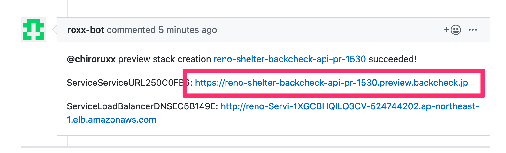

# ROXX-bot

ROXX-botはbackcheckのプレビュー環境を構築するbotです。

## 使い方
### 概要
だいたいの概要を掴んでもらうための説明です。(**※正常に動作させるにはオプションが必要です**)  
実際に使用する際はユースケースを参照してください。

1. GitHub上でプルリクエストを作成します。
1. プルリクエスト上で「`@roxx-bot preview this`」とコメントします。
1. roxx-botさんがちょこちょことコメントを残していきます。(最長で30秒ほどかかります)
1. しばらく経つとそのプルリクエスト(=base branch)のコードが反映された環境が立ち上がり、URLが表示されます。(だいたい2分ほどかかります)

    

1. backcheckの環境は1リポジトリでは完結しないので、もう一方の環境を立ち上げます。

    つまり、backcheck_apiのプルリクエストであればfrontを、backcheck_frontのプルリクエストであればapiのプレビュー環境を立ち上げます。

    1. 「`@roxx-bot preview front`」または「`@roxx-bot preview front`」とコメントします。

1. しばらく経つとそのプルリクエスト(=base branch)のコードが反映された環境が立ち上がり、URLが表示されます。(だいたい2分ほどかかります)

    

1. URLのリンクを踏むとプレビュー環境を見ることができます。

### ユースケース
事前に自分のプルリクエストのIDを確認します。

例えば https://github.com/reno-shelter/backcheck_api/pull/1530 だったら `1530` がIDです。

#### APIのみのプレビュー環境
1. `@roxx-bot preview this FRONT_URL=https://reno-shelter-backcheck-api-pr-${ID}-backcheck-front.preview.backcheck.jp`
1. `@roxx-bot preview front API_URL=https://reno-shelter-backcheck-api-pr-${ID}.preview.backcheck.jp`

#### FRONTのみのプレビュー環境
1. `@roxx-bot preview this API_URL=https://reno-shelter-backcheck-front-pr-${ID}-backcheck-api.preview.backcheck.jp`
1. `@roxx-bot preview api FRONT_URL=https://reno-shelter-backcheck-front-pr-${ID}.preview.backcheck.jp`

#### APIとFRONTの複合プレビュー環境
1. API側のプルリクエストで以下をコメントし、

    `@roxx-bot preview this FRONT_URL=https://reno-shelter-backcheck-front-pr-${FRONT_ID}.preview.backcheck.jp`

1. FRONT側のプルリクエストで以下をコメントする

    `@roxx-bot preview this API_URL=https://reno-shelter-backcheck-api-pr-${API_ID}.preview.backcheck.jp`

## FAQ
### adminは？
未対応です。

### プレビュー環境の効期限は？
プルリクエストのステータスが `Closed` または `Merged` になると破棄されます。

## 開発者用ガイド
[こちら](docs/README_dev.md)を参照してください。
